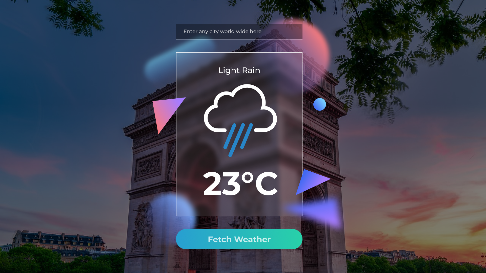

# Weather app

This is the repo of the project weather app following the tutorial from GaryBricksCode

## get up and running

download this repo and edit the index.js file with your API keys that you can find on geonames.org, weatherbit.io and pixabay.com then simply open the index.html file.

## Usage

enter the city of which you want to know the weather
and then hit the submit button.
